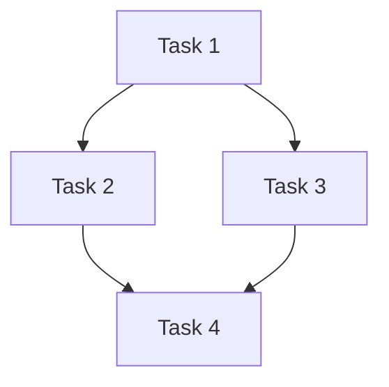

# 실행 계획 (Execution Plan)

<!-- ForgeFlow plan template. Created during plan stage. -->
<!-- Write prose in the user's primary language. Preserve canonical labels, enum values, commands, paths, and artifact filenames in English. -->

## 사용자용 요약 (Reader Summary)
<!-- For high/epic routes especially: summarize what will change, touched areas, verification, and key risks in the user's language. -->

## 라우트 (Route)
<!-- → brief.md 참조 -->

## 라우트 하위 밴드 (Route Sub-band)
<!-- → brief.md 참조 -->

## 실행 준비도 (Plan Readiness)
<!-- Complete before asking the user to cross the plan -> execute boundary. -->
- **Goal**: <!-- explicit and testable -->
- **Requirements**: <!-- mapped to stable IDs and acceptance criteria -->
- **Implementation Steps**: <!-- every step has files, expected output, verification, fulfills -->
- **Verification**: <!-- gates cover each requirement and contract -->
- **Scope Boundary**: <!-- changed files stay within approved scope; exclusions preserved -->
- **Approval Boundary**: <!-- non-auto mode stops here and asks before /forgeflow:execute -->

## 요구사항 (Requirements)
<!-- Derived from brief.md acceptance criteria -->

## 비목표 (Non-goals)
<!-- Explicitly out-of-scope items from clarify -->

## 의존성 (Dependencies)
<!-- What must exist before execution starts -->

## 아키텍처 메모 (Architecture Notes)
<!-- Key design decisions affecting execution order -->
<!-- high/epic: record Execution Pattern (pipeline | fan-out/fan-in) here -->
<!-- medium-full: contract-first traceability required; medium-light: contracts optional unless brownfield -->

## 설계 의도 (Design Intent)

## 단순성 점검 (Simplicity Check)

- **Minimal solution**:
- **Rejected abstraction/flexibility**:
- **Why this is enough now**:
<!-- Reviewer-facing intent summary. State why this design is the intended shape, not just what will change. -->
- **Problem framing**: <!-- what problem this design solves -->
- **Chosen approach**: <!-- selected design and why it is preferred -->
- **Alternatives considered**: <!-- viable alternatives rejected and why -->
- **Intentional exclusions**: <!-- behavior/scope intentionally not handled in this task -->
- **Review focus**: <!-- specific intent-code alignment risks reviewers should check -->

## 작업별 리뷰 기준 (Review Criteria)
<!-- Task-specific quality guide derived from brief.md constraints, docs/coding-convention.md, active rules, and relevant ADR/architecture docs if present. -->
- **Applicable conventions**: <!-- repo conventions that apply to this task -->
- **Applicable decisions/ADRs**: <!-- relevant ADR/design decision refs, or n/a -->
- **Acceptance traces**: <!-- acceptance criteria that review must verify -->
- **Risk checks**: <!-- security/data/API/state/rollback checks relevant to this task -->
- **Out-of-scope checks**: <!-- what reviewers should NOT demand because it was intentionally excluded -->

## 실행 패턴 (Execution Pattern)
<!-- Route strategy: small = direct single-worker; medium = pipeline; high = fan-out/fan-in when independent + separate spec/quality review; epic = milestone fan-out/fan-in -->

## 적용된 진화 규칙 (Applied Evolution Rules)
<!-- Carry forward rules from brief.md and state how this plan applies them. -->
- **Project active rules**:
- **Global advisory rules**:
- **Plan impact**:

## 작업 의존성 그래프 (Task Dependency Graph)
<!-- Optional: include only when tasks have non-trivial dependencies (high/epic routes). -->
<!-- Validate Mermaid syntax before committing; omit this section entirely for small/medium routes. -->

## 작업 목록 (Tasks)

### Task 1: <!-- name -->
- **Objective**:
- **Files**:
- **Depends on**: (none | Task N)
- **Expected output**:
- **Verification**:
- **Fulfills**: <!-- which acceptance criteria -->
- **Rollback note**: <!-- if applicable, how to revert -->

### Task 2: <!-- name -->
<!-- Copy pattern above -->

## 검증 계획 (Verification Plan)
<!-- How to verify the entire plan succeeded -->

### Check 1: <!-- target -->
- **Type**: <!-- sub_req | journey | artifact | contract -->
- **Gates**:

## 계약 (Contracts, if applicable)
- **Artifact**:
- **Interfaces**:
- **Invariants**:

## 여정 (Journeys, if applicable)
<!-- End-to-end flow verification -->
### Journey 1: <!-- name -->
- **Composes**: <!-- which tasks -->
- **Description**:

## 병렬성 (Parallelism)
<!-- Which tasks can run concurrently and any conflicts -->

## Self-Critique
<!-- Self-Critique Loop: ff-plan Phase 3 fills this section. -->
<!-- Do not leave this section empty after plan stage — critic must run. -->
<!-- Receipt-only verdict: record structured verdict, not full re-evaluation prose. -->

### Self-Critique Verdict
<!-- Receipt-only: structured verdict (inspired by gajae-code ralplan pattern). -->
<!-- ITERATE/REJECT 시에만 상세 내용을 아래에 추가. -->
- **Status**: <!-- APPROVE | ITERATE | REJECT -->
- **Findings**: <!-- [HIGH|LOW] 1-line-per-finding, e.g. "HIGH: step 3 missing rollback for migration" -->
- **Required Changes**: <!-- numbered list (if ITERATE/REJECT). Empty if APPROVE. -->

### Detailed Findings (only if Status is ITERATE or REJECT)
<!-- Expand each finding with evidence and specific remediation. Omit entirely when APPROVE. -->

### Critic Summary
- **Coverage PASS?**: <!-- yes/no — does plan satisfy every acceptance criterion and Goal Contract success criteria? -->
- **Dependency PASS?**: <!-- yes/no — no missing deps, no ordering errors, no file-conflict risks? -->
- **Verifiability PASS?**: <!-- yes/no — does every verification step produce observable evidence? -->
- **Risk gaps PASS?**: <!-- yes/no — all accepted risks acknowledged or mitigated? -->
- **Critic verdict**: <!-- PASS (all yes) | REVISED (N iterations) | OPEN_CONCERNS -->
- **Revision count**: <!-- 0–3 -->
- **Open Concerns**: <!-- remaining issues after 3 iterations, or "none" -->
## Next Steps → execute
<!-- Stage handoff contract: what the next stage needs from this artifact -->
- **Next Stage**: execute
- **Required Input**: tasks (implementation steps), files, verification plan
- **Recommended Input**: architecture notes, contracts, Self-Critique verdict
- **Known Gaps**: <!-- list open concerns from Self-Critique -->
