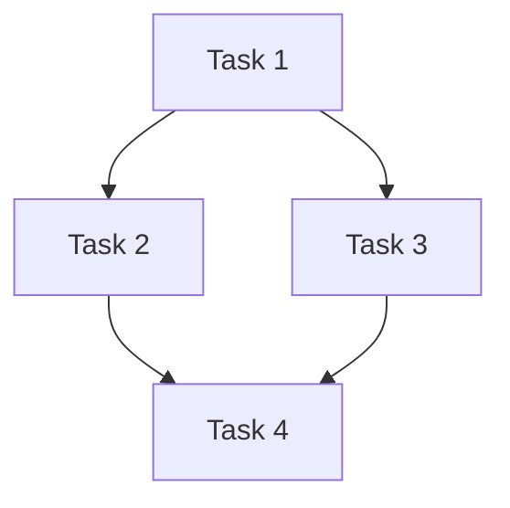

# 실행 계획 (Execution Plan)

<!-- ForgeFlow plan template. Created during plan stage. -->
<!-- Write prose in the user's primary language. Preserve canonical labels, enum values, commands, paths, and artifact filenames in English. -->

## 사용자용 요약 (Reader Summary)
<!-- For high/epic routes especially: summarize what will change, touched areas, verification, and key risks in the user's language. -->

## 라우트 (Route)
<!-- small | medium | high | epic -->
<!-- medium sub-band: medium-light | medium-full (from brief.md) -->

## 라우트 하위 밴드 (Route Sub-band)
<!-- medium-light | medium-full | n/a -->

## 요구사항 (Requirements)
<!-- Derived from brief.md acceptance criteria -->

## 비목표 (Non-goals)
<!-- Explicitly out-of-scope items from clarify -->

## 의존성 (Dependencies)
<!-- What must exist before execution starts -->

## 아키텍처 메모 (Architecture Notes)
<!-- Key design decisions affecting execution order -->
<!-- high/epic: record Execution Pattern (pipeline | fan-out/fan-in) here -->
<!-- medium-full: contract-first traceability required; medium-light: contracts optional unless brownfield -->

## 설계 의도 (Design Intent)

## 단순성 점검 (Simplicity Check)

- **Minimal solution**:
- **Rejected abstraction/flexibility**:
- **Why this is enough now**:
<!-- Reviewer-facing intent summary. State why this design is the intended shape, not just what will change. -->
- **Problem framing**: <!-- what problem this design solves -->
- **Chosen approach**: <!-- selected design and why it is preferred -->
- **Alternatives considered**: <!-- viable alternatives rejected and why -->
- **Intentional exclusions**: <!-- behavior/scope intentionally not handled in this task -->
- **Review focus**: <!-- specific intent-code alignment risks reviewers should check -->

## 작업별 리뷰 기준 (Review Criteria)
<!-- Task-specific quality guide derived from brief.md constraints, docs/coding-convention.md, active rules, and relevant ADR/architecture docs if present. -->
- **Applicable conventions**: <!-- repo conventions that apply to this task -->
- **Applicable decisions/ADRs**: <!-- relevant ADR/design decision refs, or n/a -->
- **Acceptance traces**: <!-- acceptance criteria that review must verify -->
- **Risk checks**: <!-- security/data/API/state/rollback checks relevant to this task -->
- **Out-of-scope checks**: <!-- what reviewers should NOT demand because it was intentionally excluded -->

## 실행 패턴 (Execution Pattern)
<!-- Route strategy: small = direct single-worker; medium = pipeline; high = fan-out/fan-in when independent + separate spec/quality review; epic = milestone fan-out/fan-in -->

## 적용된 진화 규칙 (Applied Evolution Rules)
<!-- Carry forward rules from brief.md and state how this plan applies them. -->
- **Project active rules**:
- **Global advisory rules**:
- **Plan impact**:

## 작업 의존성 그래프 (Task Dependency Graph)
<!-- Optional: include only when tasks have non-trivial dependencies (high/epic routes). -->
<!-- Validate Mermaid syntax before committing; omit this section entirely for small/medium routes. -->

## 작업 목록 (Tasks)

### Task 1: <!-- name -->
- **Objective**:
- **Files**:
- **Depends on**: (none | Task N)
- **Expected output**:
- **Verification**:
- **Fulfills**: <!-- which acceptance criteria -->
- **Rollback note**: <!-- if applicable, how to revert -->

### Task 2: <!-- name -->
<!-- Copy pattern above -->

## 검증 계획 (Verification Plan)
<!-- How to verify the entire plan succeeded -->

### Check 1: <!-- target -->
- **Type**: <!-- sub_req | journey | artifact | contract -->
- **Gates**:

## 계약 (Contracts, if applicable)
- **Artifact**:
- **Interfaces**:
- **Invariants**:

## 여정 (Journeys, if applicable)
<!-- End-to-end flow verification -->
### Journey 1: <!-- name -->
- **Composes**: <!-- which tasks -->
- **Description**:

## 병렬성 (Parallelism)
<!-- Which tasks can run concurrently and any conflicts -->
