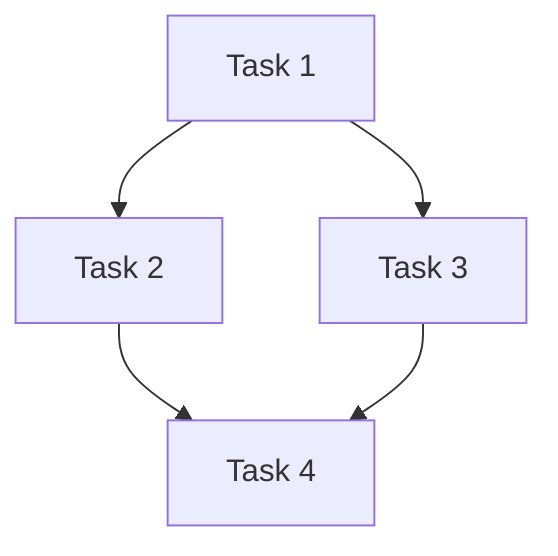

# Execution Plan

<!-- ForgeFlow plan template. Created during plan stage. -->

## Route
<!-- small | medium | high | epic -->
<!-- medium sub-band: medium-light | medium-full (from brief.md) -->

## Route Sub-band
<!-- medium-light | medium-full | n/a -->

## Requirements
<!-- Derived from brief.md acceptance criteria -->

## Non-goals
<!-- Explicitly out-of-scope items from clarify -->

## Dependencies
<!-- What must exist before execution starts -->

## Architecture Notes
<!-- Key design decisions affecting execution order -->
<!-- high/epic: record Execution Pattern (pipeline | fan-out/fan-in) here -->
<!-- medium-full: contract-first traceability required; medium-light: contracts optional unless brownfield -->

## Applied Evolution Rules
<!-- Carry forward rules from brief.md and state how this plan applies them. -->
- **Project active rules**:
- **Global advisory rules**:
- **Plan impact**:

## Task Dependency Graph

## Tasks

### Task 1: <!-- name -->
- **Objective**:
- **Files**:
- **Depends on**: (none | Task N)
- **Expected output**:
- **Verification**:
- **Fulfills**: <!-- which acceptance criteria -->
- **Rollback note**: <!-- if applicable, how to revert -->

### Task 2: <!-- name -->
<!-- Copy pattern above -->

## Verification Plan
<!-- How to verify the entire plan succeeded -->

### Check 1: <!-- target -->
- **Type**: <!-- sub_req | journey | artifact | contract -->
- **Gates**:

## Contracts (if applicable)
- **Artifact**:
- **Interfaces**:
- **Invariants**:

## Journeys (if applicable)
<!-- End-to-end flow verification -->
### Journey 1: <!-- name -->
- **Composes**: <!-- which tasks -->
- **Description**:

## Parallelism
<!-- Which tasks can run concurrently and any conflicts -->
