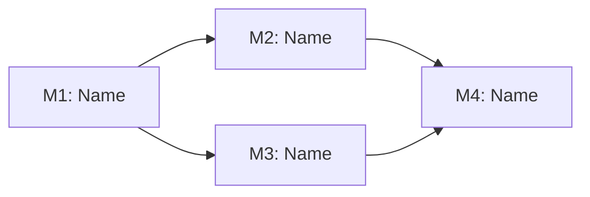

# Milestone Roadmap

<!-- ForgeFlow epic decomposition. Created during milestone stage. -->

## Objective
<!-- One-paragraph project scope -->

## Milestones

## Milestone DAG

### M1: <!-- name -->
- **Objective**:
- **Success criteria**:
- **Depends on**: (none | M N)
- **Status**: <!-- planned | in_progress | completed | blocked -->

### M2: <!-- name -->
<!-- Copy pattern above -->

## Tasks per Milestone

### M1 Tasks
- [ ] <!-- task description -->

### M2 Tasks
- [ ] <!-- task description -->

## Integration Verification
<!-- Final milestone that verifies all previous milestones integrate correctly -->

## Progress Summary
<!-- Overall completion status -->
