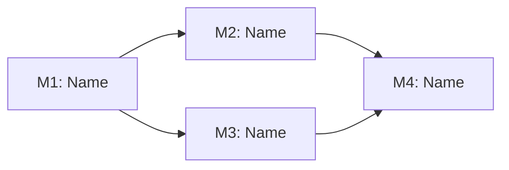

# 마일스톤 로드맵 (Milestone Roadmap)

<!-- ForgeFlow epic decomposition. Created during plan stage (epic route). -->
<!-- Write prose in the user's primary language. Preserve canonical labels, enum values, commands, paths, and artifact filenames in English. -->

## 목표 (Objective)
<!-- One-paragraph project scope -->

## 마일스톤 (Milestones)

## 마일스톤 의존 그래프 (Milestone DAG)

### M1: <!-- name -->
- **목표 (Objective)**:
- **성공 기준 (Success Criteria)**:
- **의존 (Depends on)**: (none | M N)
- **상태 (Status)**: <!-- planned | in_progress | completed | blocked -->

### M2: <!-- name -->
<!-- Copy pattern above -->

## 마일스톤별 작업 (Tasks per Milestone)

### M1 Tasks
- [ ] <!-- task description -->

### M2 Tasks
- [ ] <!-- task description -->

## 통합 검증 (Integration Verification)
<!-- Final milestone that verifies all previous milestones integrate correctly -->

## 진행 요약 (Progress Summary)
<!-- Overall completion status -->
